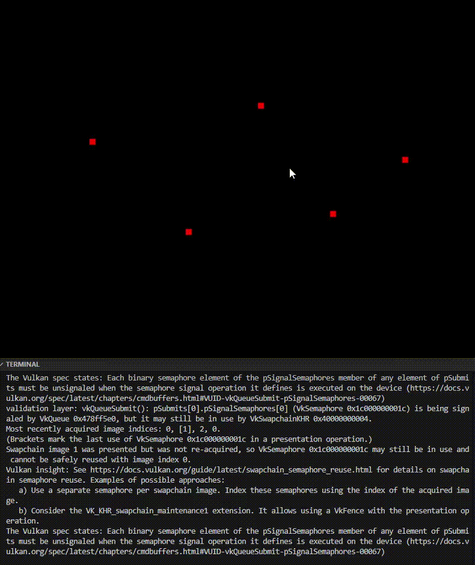

# Computer Project #1: Dots (Vulkan + GLFW)

This project draws dots using Vulkan point primitives and supports interactive dot placement via mouse input.

<p align="center">
  
</p>

## Features

- **Phase 1 (Static dots):** Draw multiple dots at startup.
- **Phase 2 (Interactive dots):** Add dots using mouse clicks.
- **Phase 3 (Reset View):** Clear all dots with a key press.
- **Phase 4 (Remove dots):** Press 'D' to remove the most recently added dot.
  
## Build & Run:

### Build
Use the provided course template build workflow (Makefile / script).

### Run (important)
Run the executable with the **project root** as the working directory so shader files can be loaded from:
- `./shaders/*.spv`

If you use **VS Code**, set the working directory in `.vscode/launch.json`:
```json
"cwd": "${workspaceFolder}"
```

## Controls

- **Left Click:** Add a dot at the cursor position  
- **SPACE:** Reset view (clear all dots)

## Shader Compilation

Double-click compile-win.bat in the project root, or run it from the VS Code terminal:

```bash
.\compile-win.bat
```

If successful, the following two files should be created in the shaders/ folder:

- `simple_shader.vert.spv`
- `simple_shader.frag.spv`

After that, press F5 to debug and run the program normally.

If the .bat fails, compile directly with glslc:

```bash
glslc shaders/simple_shader.vert -o shaders/simple_shader.vert.spv
glslc shaders/simple_shader.frag -o shaders/simple_shader.frag.spv
```

## Notes

- Dots are rendered with `VK_PRIMITIVE_TOPOLOGY_POINT_LIST`.
- Dot placement converts window pixel coordinates to NDC coordinates `[-1, 1]`.
